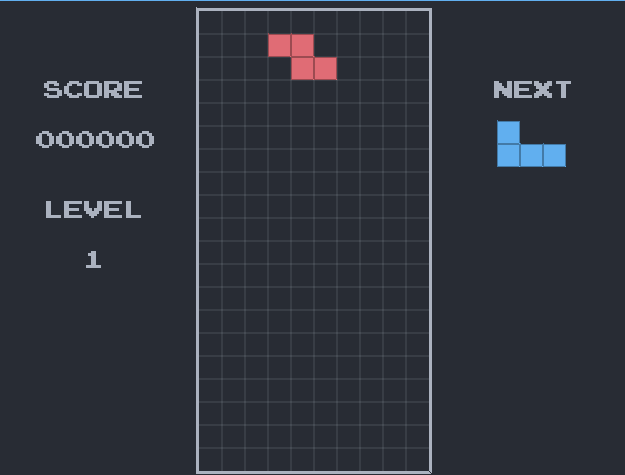

# Yet Another Tetris Clone (YATC)
 

  

 

  

Tetris clone made with C++ and the SDL 2.0 library.

## Features

  * Software-emulated key delay and repeat.
  * Super Rotation System as in the official tetris guidelines.
  * NES tetris scoring and leveling systems.

## Controls

  * Move Pieces: Arrow Keys.
  * Confirm Selection / Rotate Pieces: Z Key, Enter
  * Rotate Pieces: X Key, Z Key.

## Requirements

  * A GNU/Linux Distribution.
  * The gcc C++ compiler.
  * SDL2 Library. You can normally install the compiled libraries 
  system wide using the package manager of your distribution, e.g.,
    * Debian based (Including Ubuntu): `sudo apt-get install libsdl2-2.0-0
    libsdl2-image-2.0-0 libdsl2-mixer-2.0-0 libsdl2-ttf-2.0-0`
    * Arch based: `sudo pacman -S sdl2 sdl2_image sdl2_mixer sdl22_ttf`
    * Red Hat based (Including Fedora): `sudo yum install SDL2`

## Build and Run instructions

  * Change the directory to the one you have cloned, e.g.,
  _yet_another_tetris_clone_
  * Run `make`
  * Run the executable `bin/tetris`

## Acknowledgements

  * PressStart2P fonts from [Cody "CodeMan38" Boisclair](https://github.com/codeman38)
  * Sound Effects created with [sfxr](https://www.drpetter.se/project_sfxr.html) from Thomas Pettersson
  * General Information about Tetris from [TetrisWiki](https://tetris.wiki)

